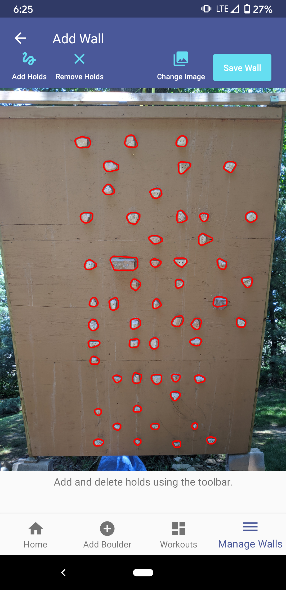
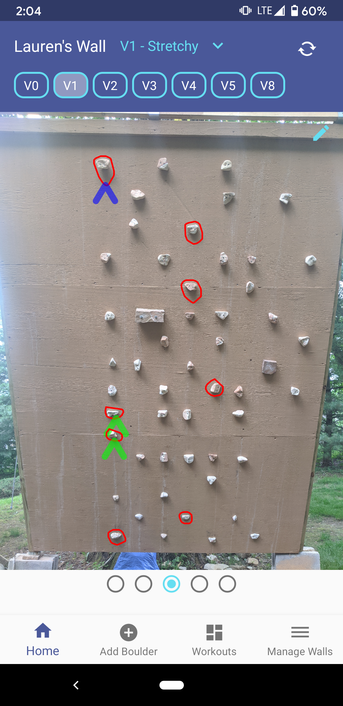
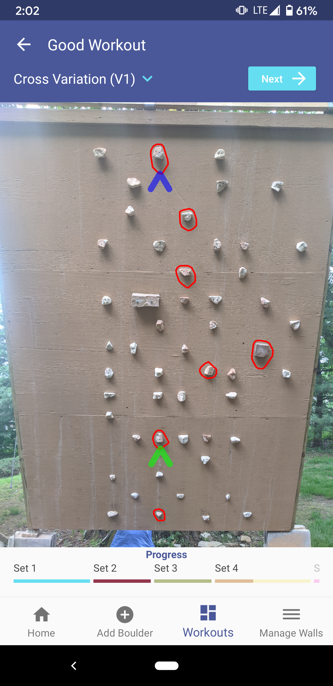

# MyRoutes
Android mobile app to create and save bouldering routes on a climbing wall, as well as to generate workouts from those boulders. 

## App Features

### Automatically detect climbing holds from a photo
The app uses computer vision techniques of edge detection and morphological gradient in order to automatically detect the location of climbing holds on a user-uploaded photo of a climbing wall. If the hold detection is not perfect, the user can easily add holds that were missed or remove extraneous holds. Once the user is done editing the location of climbing holds on a wall, they can save the wall to a database and share the wall with friends. 

### Keep track of bouldering routes 
A user can easily create a new bouldering route by tapping on the holds they wish to be part of the route. They can also select the start and finish holds for a boulder. Saved boulders are easily accessed in sorted order of boulder difficulty and by list format. 

 
 ### Create bouldering workouts
A user can create semi-randomized workouts for themselves that consist of different sets of climbs, with breaks in between sets. For each set, the user specifies a boulder difficulty and a number of boulders, and the set is automatically generated by randomly sampling saved boulders.  

